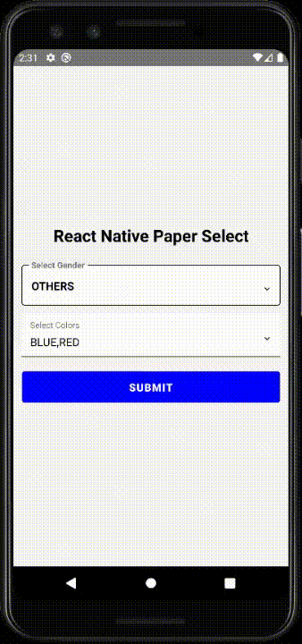
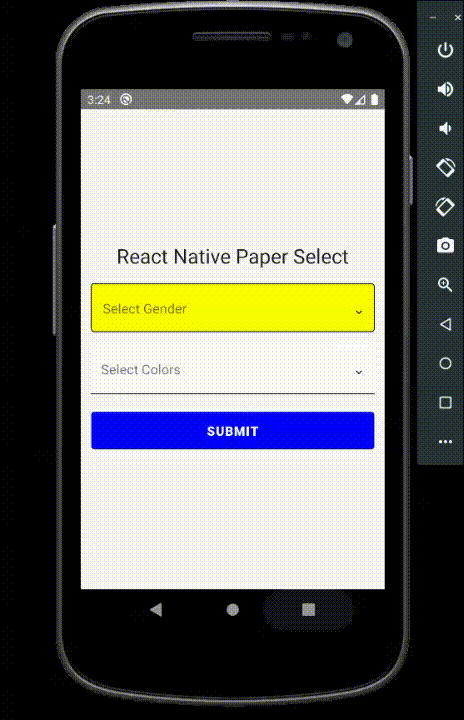
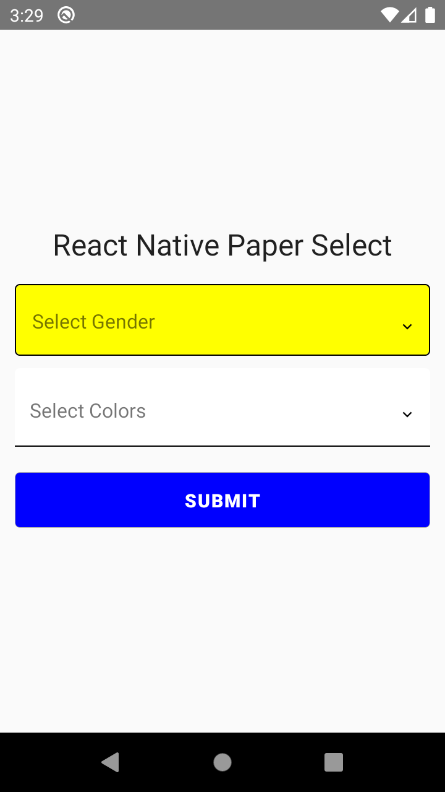
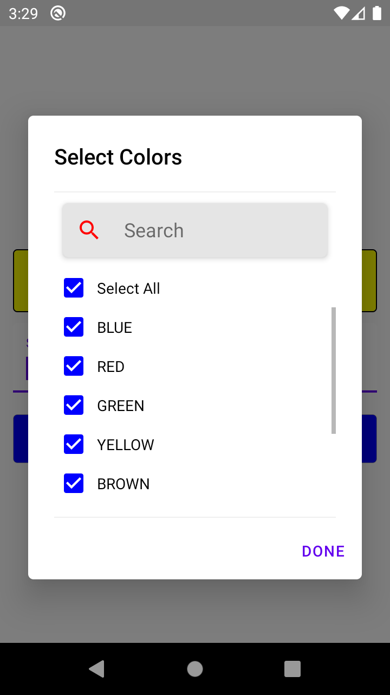
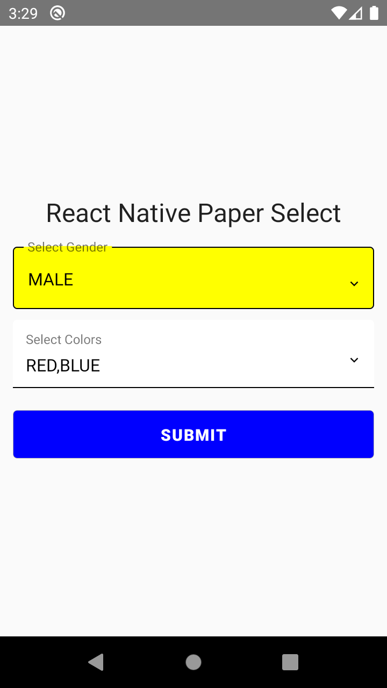
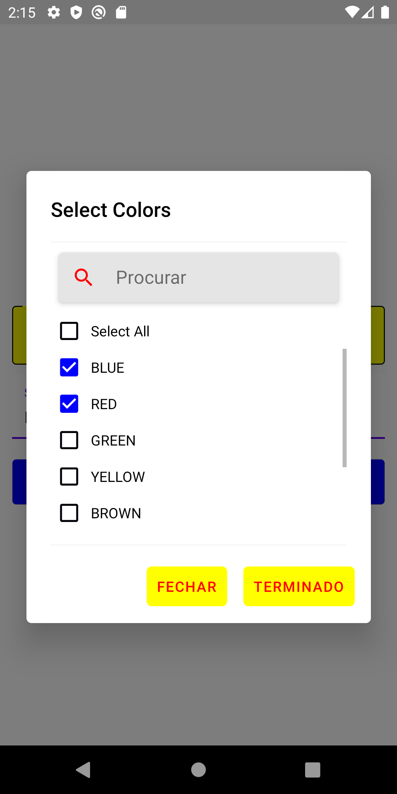

# React Native Paper Select 🔽

[](https://openbase.com/js/react-native-paper-select?utm_source=embedded&amp;utm_medium=badge&amp;utm_campaign=rate-badge)
[](https://kandi.openweaver.com/typescript/srivastavaanurag79/react-native-paper-select)
[](https://www.npmjs.com/package/react-native-paper-select)
[](https://www.npmjs.com/package/react-native-paper-select)
[](https://www.npmjs.com/package/react-native-paper-select)
[](https://github.com/srivastavaanurag79/react-native-paper-select)
[](https://www.typescriptlang.org/)
[](https://reactnative.dev/)

- This module includes a [customizable](#customization-options) multi-select and a single select component for **React Native Paper**.
- The package is both **Android** and **iOS** compatible.
- The package is well-typed and supports **TypeScript**.
- Smooth and fast.
- Type-safe

**Give us a GitHub star 🌟, if you found this package useful.**
[](https://github.com/srivastavaanurag79/react-native-paper-select)

Enjoying react-native-paper-select? [Please leave a short review on Openbase](https://openbase.com/js/react-native-paper-select#rate)

Check out the new [Documentation](https://anurag-srivastava.gitbook.io/react-native-paper-select).

[Go to Customizable Properties](https://anurag-srivastava.gitbook.io/react-native-paper-select/guides/customizations)

Check out the [Example](https://anurag-srivastava.gitbook.io/react-native-paper-select/example) code or you can check the example source code in [example module](https://github.com/srivastavaanurag79/react-native-paper-select/tree/master/example).

[React Native Paper Select (NPM Link)](https://www.npmjs.com/package/react-native-paper-select)

## Demo/Screenshots

<p float="left">


  
  
  
  
</p>

## Dependencies

```bash
react-native-paper
react-native-vector-icons
```

## Installation

```bash
npm install react-native-paper-select
```

or

```bash
yarn add react-native-paper-select
```

## Customization Options

The table consists of 5 columns. Please go through the table properly.

| props                      | type                                                                                                                                                                       | description                                                                                                          | default value                                                                      | required |
| -------------------------- | -------------------------------------------------------------------------------------------------------------------------------------------------------------------------- | -------------------------------------------------------------------------------------------------------------------- | ---------------------------------------------------------------------------------- | -------- |
|   label                    | string                                                                                                                                                                     | Input Label                                                                                                          | set to empty string if you don’t want to display                                   | yes      |
|   arrayList                | Array<{  \_id: string; value: string;}>                                                                                                                                    | Array of items. Should be an array of objects with \_id and value property.example: \[{"\_id": 1, "value": "Red"}\]. | there isn't any default value you need to specify a list.                          | yes      |
|   selectedArrayList        | Array<{  \_id: string; value: string;}>                                                                                                                                    | selected elements or preselected elements                                                                            | set empty array as default                                                         | yes      |
|   multiEnable              | boolean                                                                                                                                                                    | true if you want to use multi select, false if you want single select                                                | no default value                                                                   | yes      |
|   errorText                | string                                                                                                                                                                     | text to display on error                                                                                             | set to empty string as default                                                     | yes      |
|   value                    | string                                                                                                                                                                     | default value you want to display                                                                                    | bind it with your variable                                                         | yes      |
|   containerStyle           | ViewStyle                                                                                                                                                                  | Surrounding container style                                                                                          | no default value                                                                   | no       |
|   dialogStyle              | {backgroundColor?: ViewStyle\['backgroundColor'\]; borderRadius?: ViewStyle\['borderRadius'\];}                                                                            | dialog box style                                                                                                     | {backgroundColor:'white', borderRadius: 5}                                         | no       |
|   dialogTitle              | string                                                                                                                                                                     | title shown in the dialog                                                                                            | defaults to the value of `label`                                                   | no       |
|   dialogTitleStyle         | TextStyle                                                                                                                                                                  | dialog box title style                                                                                               | default react native paper style                                                   | no       |
|   searchStyle              | {backgroundColor?: ViewStyle\['backgroundColor'\]; textColor?: TextStyle\['color'\]; borderRadius?: number; borderColor?: ViewStyle\['borderColor'\]; iconColor?: string;} | search bar style in dialog box                                                                                       | {borderRadius:5, borderColor:'#e5e5e5', backgroundColor: '#e5e5e5', color: '#000'} | no       |
|   disabled                 | boolean                                                                                                                                                                    | whether the input (and dialog) are disabled and cannot be opened                                                     | false                                                                              | no       |
|   checkboxUncheckedColor   | string                                                                                                                                                                     | checkbox unchecked color                                                                                             | #000007                                                                            | no       |
|   checkboxColor            | string                                                                                                                                                                     | checkbox checked color                                                                                               | blue                                                                               | no       |
|   checkboxLabelStyle       | TextStyle                                                                                                                                                                  | checkbox label style                                                                                                 | default react native paper style                                                   | no       |
|   errorStyle               | TextStyle                                                                                                                                                                  | error style                                                                                                          | default react native paper style                                                   | no       |
|   textInputMode            | flat or outlined                                                                                                                                                           | input style flat or outlined                                                                                         | outlined                                                                           | no       |
|   underlineColor           | string                                                                                                                                                                     | underline color (if input mode is flat)                                                                              | black                                                                              | no       |
|   activeUnderlineColor     | string                                                                                                                                                                     | active underline color (if input mode is flat)                                                                       | black                                                                              | no       |
|   activeOutlineColor       | string                                                                                                                                                                     | active border color (if input mode is outlined)                                                                      | black                                                                              | no       |
|   outlineColor             | string                                                                                                                                                                     | border color (if input mode is outlined)                                                                             | black                                                                              | no       |
|   textInputBackgroundColor | string                                                                                                                                                                     | text input background color                                                                                          | white                                                                              | no       |
|   textInputColor           | string                                                                                                                                                                     | text input text color                                                                                                | black                                                                              | no       |
|   textInputHeight          | number                                                                                                                                                                     | text input height                                                                                                    | default react native paper style                                                   | no       |
|   textInputStyle           | TextStyle                                                                                                                                                                  | text input text style                                                                                                | default react native paper style                                                   | no       |
|   dialogButtonLabelStyle   | TextStyle                                                                                                                                                                  | dialog button style                                                                                                  | default react native paper style                                                   | no       |
|   hideSearchBox            | boolean                                                                                                                                                                    | hide searchbox in modal                                                                                              | false                                                                              | no       |
|   searchPlaceholder        | string                                                                                                                                                                     | search placeholder                                                                                                   | Search                                                                             | no       |
|   modalCloseButtonText     | string                                                                                                                                                                     | Close button text in modal                                                                                           | Close                                                                              | no       |
|   modalDoneButtonText      | string                                                                                                                                                                     | Done button text in modal                                                                                            | Done                                                                               | no       |

## Try it out

You can run the example module by performing these steps:

```
git clone https://github.com/srivastavaanurag79/react-native-paper-select.git
cd react-native-paper-select && cd example
npm install
cd ios && pod install && cd ..
react-native run-ios
react-native run-android
```

## Author

- Anurag Srivastava [(@srivastavaanurag79)](https://github.com/srivastavaanurag79)

## Contributors

- ahmed [(@Bo7mid3)](https://github.com/Bo7mid3)
- Thom van den Akker [(@Thodor12)](https://github.com/Thodor12)

## Contributing

See the [contributing guide](CONTRIBUTING.md) to learn how to contribute to the repository and the development workflow.

## License

MIT

