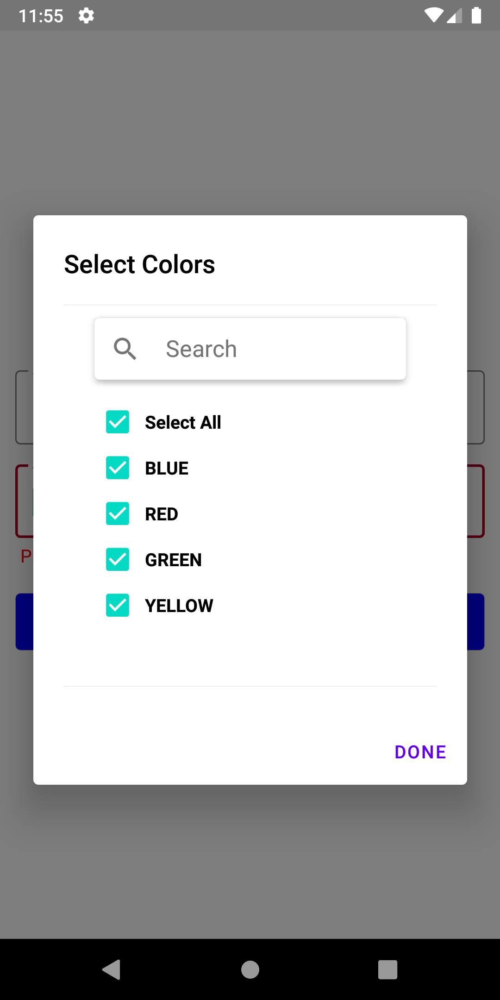
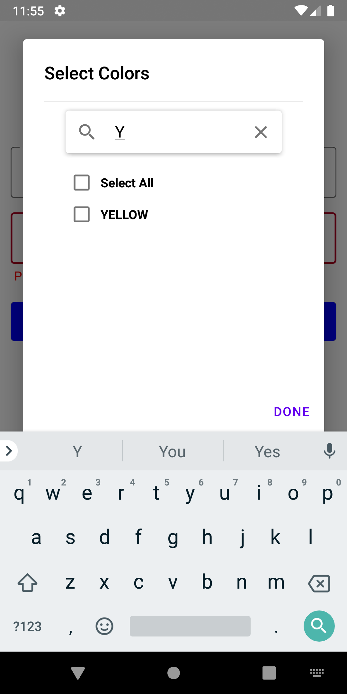
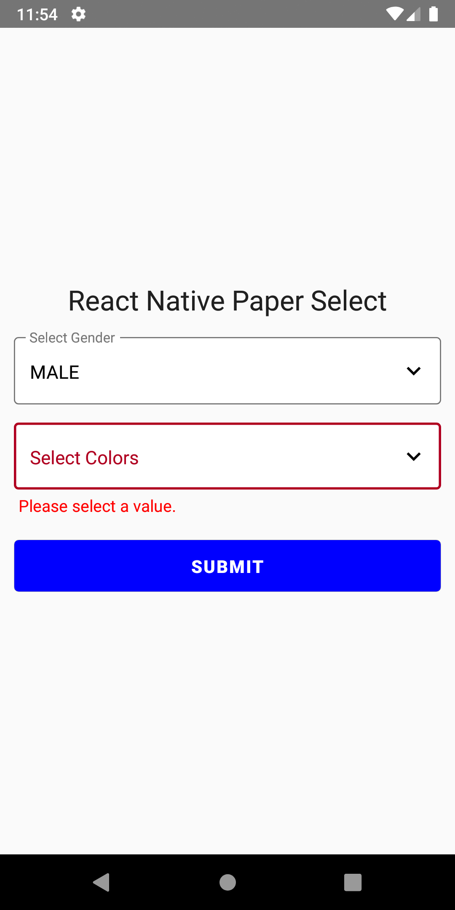

# react-native-paper-select

Material Design Select Dropdown Component using React Native Paper.
Please refer to Example provided below. Multi Select works perfectly please do not judge on the basis of GIF as screen couldn't be recorded properly.


## Dependencies

```sh
react-native-paper
react-native-vector-icons
```

## Installation

```sh
npm install react-native-paper-select
```

or

```sh
yarn add react-native-paper-select
```


## Basic Usage

```js
import PaperSelect from 'react-native-paper-select';

// ...

<PaperSelect
  label="Select Gender"
  value={gender.value}
  onSelection={(value: any) => {
    setGender({
      ...gender,
      value: value.text,
      selectedList: value.selectedList,
      error: '',
    });
  }}
  arrayList={[...gender.list]}
  selectedArrayList={gender.selectedList}
  error={!!gender.error}
  errorText={gender.error}
  multiEnable={false}
/>;
```

### Props

| Setting                        | Type       | Description                                                                                                                                                                                                                                                                                                                                              | Default Value       |
| :----------------------------- | :--------- | :------------------------------------------------------------------------------------------------------------------------------------------------------------------------------------------------------------------------------------------------------------------------------------------------------------------------------------------------------- | :------------------ |
| label                | string    | select input label                                                                                                                                                                                                                                                                              |                |
| arrayList                    | Array<{_id: string, value: string}>     | Array of items from which to select. Should be an array of objects with `_id` and `value` properties. example: [{"_id": 1, "value": "Red"}].                                                                                                                                                                                                                                                                                             |             |
| selectedArrayList                       | Array<{_id: string, value: string}>    | selected elements from dropdown                                                                                                                                                                                                                                                                                                                                     |               |
| multiEnable                           | boolean | `true` if you want to select multiple element, `false` if you want to select single |                |
| errorText                        | String     | text you want to show in case of error                                                                                                                                                                                                                                                                                                           |            |
| value                      | String     | default text value to be shown in the field                                                                                                                                                                                                                                                                                                          |               |

### Callback Methods

- `onSelection` - Return the selected item when an item is checked.
  Example : (onSelect)="onItemSelect($event)"


### Custom Theme

- Please refer to React Native Paper theme to add custom theme.


## Example

```js

import React, { useState } from 'react';

import { Alert, StyleSheet, View } from 'react-native';
import { Button as PaperButton, Headline } from 'react-native-paper';
import { PaperSelect } from 'react-native-paper-select';

export const selectValidator = (value: any) => {
  if (!value || value.length <= 0) {
    return 'Please select a value.';
  }

  return '';
};

export default function App() {
  const [gender, setGender] = useState({
    value: '',
    list: [
      { _id: '1', value: 'MALE' },
      { _id: '2', value: 'FEMALE' },
      { _id: '3', value: 'OTHERS' },
    ],
    selectedList: [],
    error: '',
  });
  const [colors, setColors] = useState({
    value: '',
    list: [
      { _id: '1', value: 'BLUE' },
      { _id: '2', value: 'RED' },
      { _id: '3', value: 'GREEN' },
      { _id: '4', value: 'YELLOW' },
    ],
    selectedList: [],
    error: '',
  });

  return (
    <View style={styles.container}>
      <Headline style={{ marginBottom: 10 }}>
        React Native Paper Select
      </Headline>
      <PaperSelect
        label="Select Gender"
        value={gender.value}
        onSelection={(value: any) => {
          setGender({
            ...gender,
            value: value.text,
            selectedList: value.selectedList,
            error: '',
          });
        }}
        arrayList={[...gender.list]}
        selectedArrayList={gender.selectedList}
        error={!!gender.error}
        errorText={gender.error}
        multiEnable={false}
      />
      <PaperSelect
        label="Select Colors"
        value={colors.value}
        onSelection={(value: any) => {
          setColors({
            ...colors,
            value: value.text,
            selectedList: value.selectedList,
            error: '',
          });
        }}
        arrayList={[...colors.list]}
        selectedArrayList={colors.selectedList}
        error={!!colors.error}
        errorText={colors.error}
        multiEnable={true}
      />
      <PaperButton
        style={styles.button}
        labelStyle={styles.text}
        mode={'outlined'}
        onPress={() => {
          const genderError = selectValidator(gender.value);
          const colorError = selectValidator(colors.value);
          if (genderError || colorError) {
            setColors({ ...colors, error: colorError });
            setGender({ ...gender, error: genderError });
            return;
          }
          Alert.alert(
            'Selected Values',
            'Gender: ' + gender.value + ' and Colors: ' + colors.value
          );
        }}
      >
        Submit
      </PaperButton>
    </View>
  );
}

const styles = StyleSheet.create({
  container: {
    flex: 1,
    alignItems: 'center',
    justifyContent: 'center',
    paddingHorizontal: 12,
  },
  box: {
    width: 60,
    height: 60,
    marginVertical: 20,
  },

  button: {
    marginVertical: 10,
    width: '100%',
    backgroundColor: 'blue',
  },
  text: {
    fontWeight: 'bold',
    fontSize: 15,
    lineHeight: 26,
    color: 'white',
  },
});
```

## Demo






## Contributing

See the [contributing guide](CONTRIBUTING.md) to learn how to contribute to the repository and the development workflow.

## License

MIT
