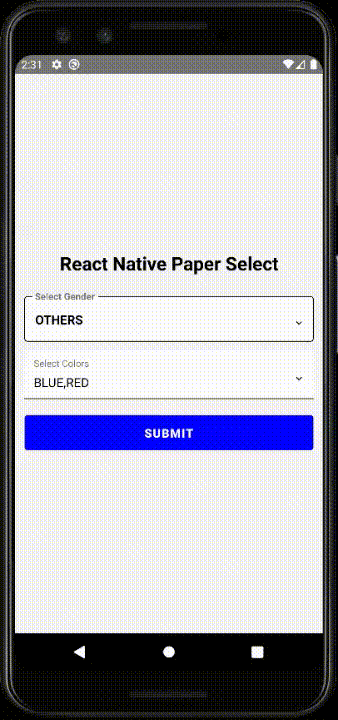
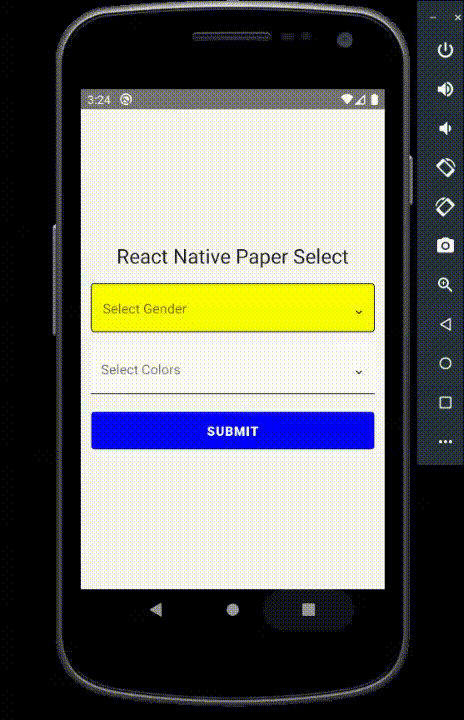
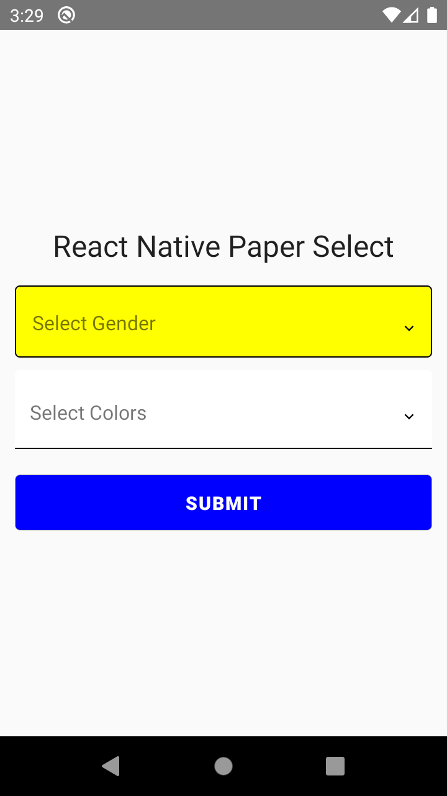
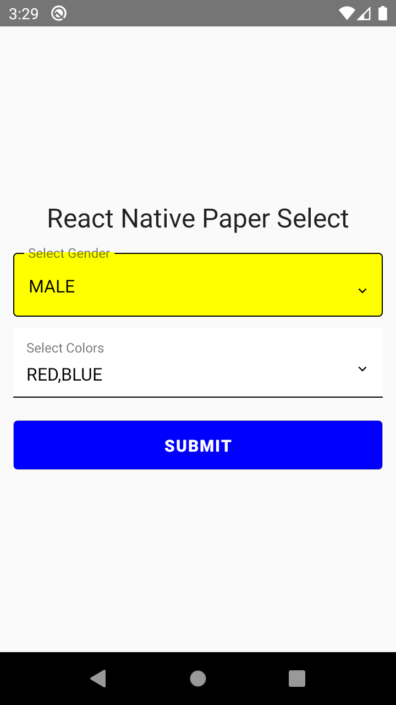
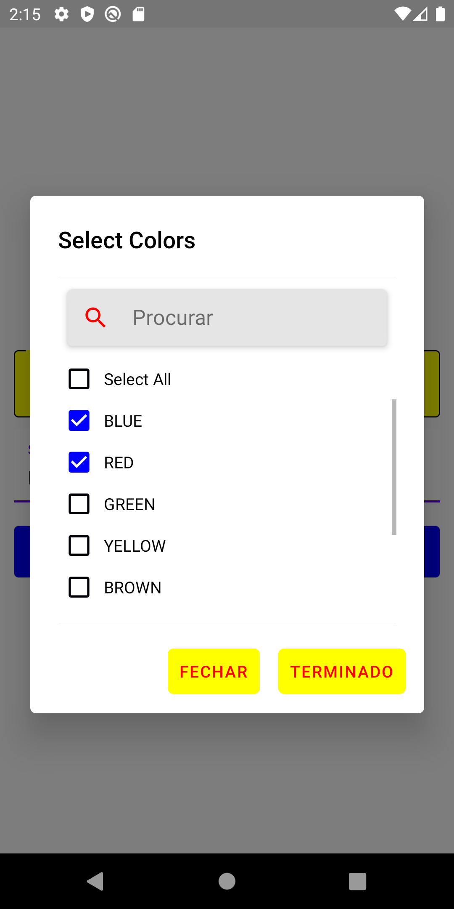
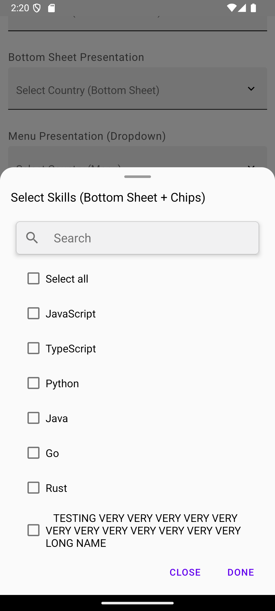
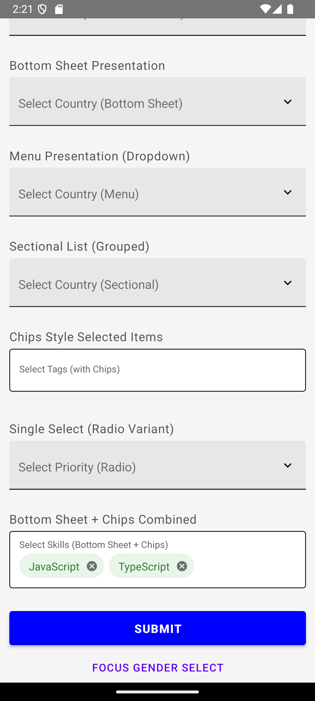
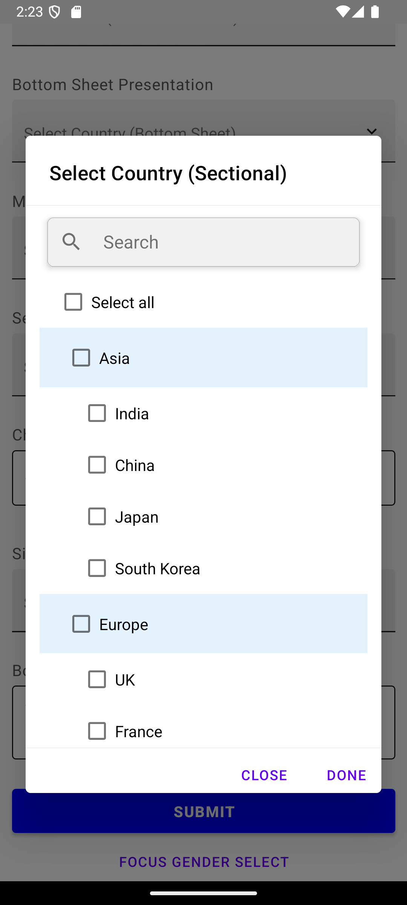
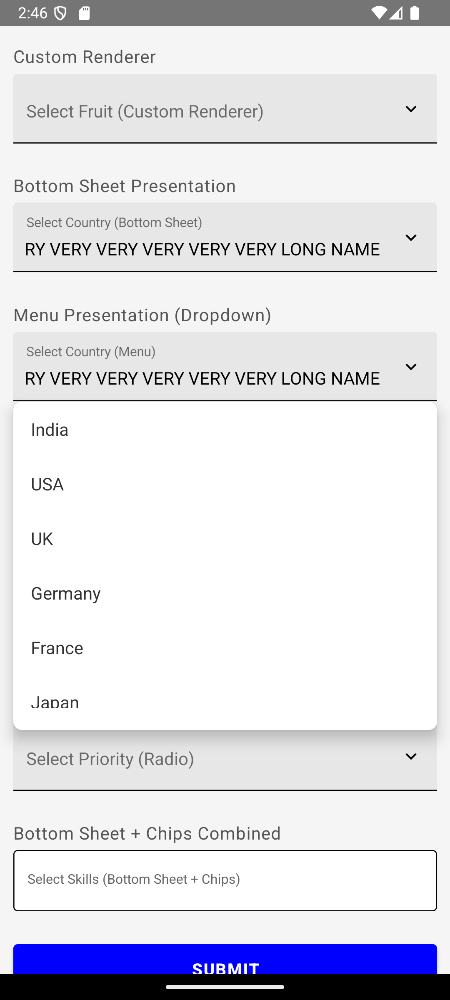

# React Native Paper Select 🔽

[](https://www.npmjs.com/package/react-native-paper-select)
[](https://www.npmjs.com/package/react-native-paper-select)
[](https://www.npmjs.com/package/react-native-paper-select)
[](https://packagequality.com/#?package=react-native-paper-select)

- This module includes a [customizable](#customization-options) multi-select and a single select component for **React Native Paper**.
- The package is both **Android** and **iOS** compatible.
- The package is well-typed and supports **TypeScript**.
- Smooth and fast.
- Type-safe
- **Bottom Sheet Presentation** - Slide-up bottom sheet instead of dialog for better mobile UX
- **Menu Presentation** - Dropdown menu style for compact selection
- **Sectional List** - Grouped items with section headers and section-level select all
- **Chips Display** - Show selected items as chips inside the input field
- **Radio Button Variant** - Radio button style for single select

**Give us a GitHub star 🌟, if you found this package useful.**
[](https://github.com/srivastavaanurag79/react-native-paper-select)

Check out the new [Documentation](https://anurag-srivastava.gitbook.io/react-native-paper-select).

Check out the [Example](https://anurag-srivastava.gitbook.io/react-native-paper-select/example) code or you can check the example source code in [example module](https://github.com/srivastavaanurag79/react-native-paper-select/tree/master/example).

[React Native Paper Select (NPM Link)](https://www.npmjs.com/package/react-native-paper-select)

## Demo/Screenshots

<p float="left">


  
  
  
  
  
  
  
</p>

## New Features

### Bottom Sheet Presentation
Slide-up bottom sheet that takes up 70% of the screen height. Ideal for mobile UX. Use presentationStyle="bottomSheet" to enable.

### Menu Presentation
Dropdown menu style for compact selection. Use presentationStyle="menu" to enable.

### Sectional List
Group items under section headers with section-level select all functionality. Pass an array of Section objects to the sections prop.

### Chips Display
Show selected items as removable chips inside the input field instead of comma-separated text. Enable with showChips={true}.

### Radio Button Variant
Use radio buttons instead of checkboxes for single select. Set singleSelectVariant="radio" to enable.

## Dependencies

```
react-native-paper
react-native-vector-icons
@shopify/flash-list
```

## Installation

Note: @shopify/flash-list is used from 1.3.0 in
eact-native-paper-select. Please install the correct version depending on the react native version you are using.

If you are using <b>React Native Paper v5.x</b> please install the versions above 0.4.1 or above, since <TextInput.Icon> attributes are changed in v5.x else version 0.4.0 would work fine.

```
npm install react-native-paper-select
```

or

```
yarn add react-native-paper-select
```

## Customization Options

See the [API docs](guides/api.md)

## Try it out

You can run the example module by performing these steps:

`
git clone https://github.com/srivastavaanurag79/react-native-paper-select.git
cd react-native-paper-select && cd example
npm install
cd ios && pod install && cd ..
react-native run-ios
react-native run-android
`

## Author

- Anurag Srivastava [(@srivastavaanurag79)](https://github.com/srivastavaanurag79)

## Contributors

- ahmed [(@Bo7mid3)](https://github.com/Bo7mid3)
- Thom van den Akker [(@Thodor12)](https://github.com/Thodor12)
- Carlos Loureiro [(@CarlosSLoureiro)](https://github.com/CarlosSLoureiro)
- b. avianto [(@avianto)](https://github.com/avianto)
- Ben Walton [(@himrocks33)](https://github.com/himrocks33)

## Contributing

See the [contributing guide](CONTRIBUTING.md) to learn how to contribute to the repository and the development workflow.

## License

MIT
